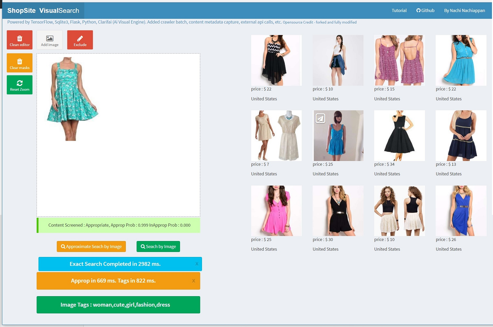
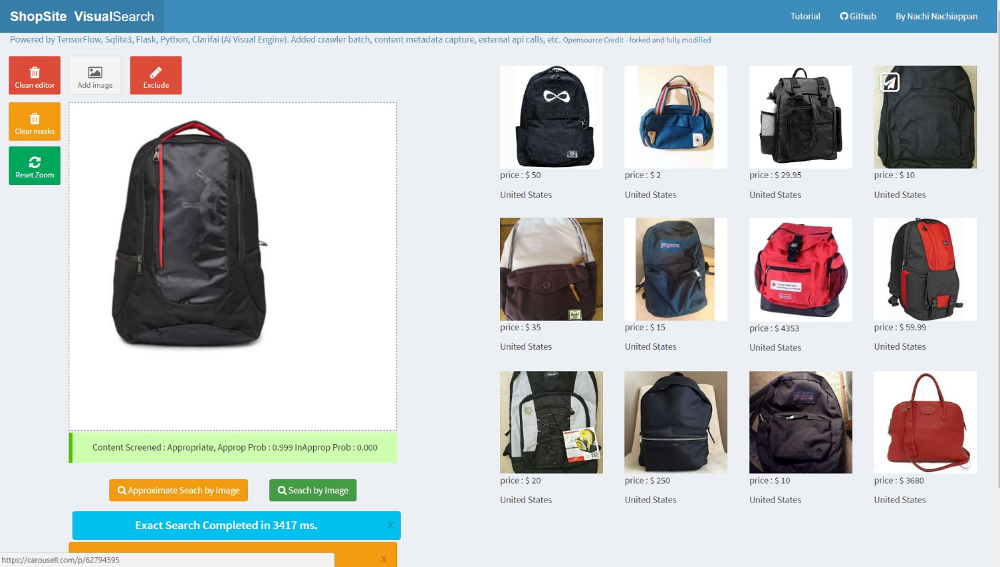

TensorFlow Search
===============

A forked project from **[Visual Search Server](https://github.com/AKSHAYUBHAT/VisualSearchServer/)** by AKSHAYU BHAT and modified to add image crawler and web app changes. 

A simple implementation of Visual Search using TensorFlow, InceptionV3 model using Google Cloud. Implements a simple visual indexing and search system, using features derived from Google's inception model trained on the imagenet data. 

You can run a crawler that crawls for sample images and metadata to run the visual search

The code implements two methods, a server that handles image search, and a simple indexer that extracts pool3 features.
Nearest neighbor search can be performed in an approximate manner using nearpy (faster) or using exact methods (slower).
 



####Running code on Google Cloud

Refer to [blog](https://avantlive.wordpress.com/2016/12/01/every-image-is-searchable-with-inception-a-crawler-in-google-cloud-for-0/) for details
Setup an account & VM to trail Google Cloud Engine as follows:


1. Create you Project
2. Create a VM Instance
3. Select Zone (near your place), Machine Type, Boot disk 
4. Allow HTTP and HTTPS traffic
5. Click on Networking and chose an external IP to be static IP (so that it can retain same IP on restarts)
6. Click on SSH keys, navigate to ~/.ssh/ and open id_rsa file we created early and copy all contents and paste it in SSH Keys

From your local dev linux machine run, ensure the HOST ip address is set in settings.py,
 ``` 
sudo fab live hostsetup 
```
ssh in to remote GCE instance and run

 ``` 
cd ~/TensorFlowSearch
sudo fab ShopSiteImages
sudo fab index 
sudo fab server 
```
 
A successful completion will result in following message:
 ``` 
[127.0.0.1] Executing task 'server'
[localhost] local: python server.py
Using index path : /home/deep/shopsite/index/*.npy
```
